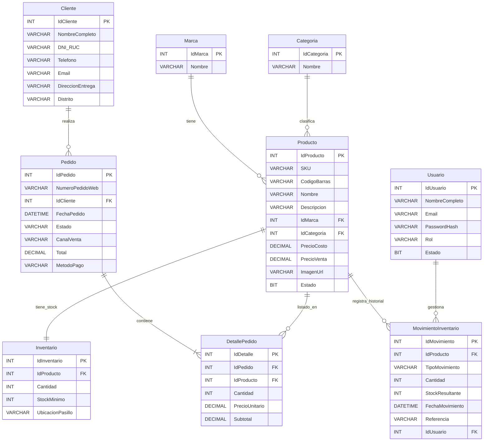

# Diagrama Entidad-Relación - MascotifyDB

```mermaid
erDiagram
    Usuario {
        INT IdUsuario PK
        VARCHAR NombreCompleto
        VARCHAR Email
        VARCHAR PasswordHash
        VARCHAR Rol
        BIT Estado
    }

    Marca {
        INT IdMarca PK
        VARCHAR Nombre
    }

    Categoria {
        INT IdCategoria PK
        VARCHAR Nombre
    }

    Producto {
        INT IdProducto PK
        VARCHAR SKU
        VARCHAR CodigoBarras
        VARCHAR Nombre
        VARCHAR Descripcion
        INT IdMarca FK
        INT IdCategoria FK
        DECIMAL PrecioCosto
        DECIMAL PrecioVenta
        VARCHAR ImagenUrl
        BIT Estado
    }

    Inventario {
        INT IdInventario PK
        INT IdProducto FK
        INT Cantidad
        INT StockMinimo
        VARCHAR UbicacionPasillo
    }

    Cliente {
        INT IdCliente PK
        VARCHAR NombreCompleto
        VARCHAR DNI_RUC
        VARCHAR Telefono
        VARCHAR Email
        VARCHAR DireccionEntrega
        VARCHAR Distrito
    }

    Pedido {
        INT IdPedido PK
        VARCHAR NumeroPedidoWeb
        INT IdCliente FK
        DATETIME FechaPedido
        VARCHAR Estado
        VARCHAR CanalVenta
        DECIMAL Total
        VARCHAR MetodoPago
    }

    DetallePedido {
        INT IdDetalle PK
        INT IdPedido FK
        INT IdProducto FK
        INT Cantidad
        DECIMAL PrecioUnitario
        DECIMAL Subtotal
    }

    MovimientoInventario {
        INT IdMovimiento PK
        INT IdProducto FK
        VARCHAR TipoMovimiento
        INT Cantidad
        INT StockResultante
        DATETIME FechaMovimiento
        VARCHAR Referencia
        INT IdUsuario FK
    }

    Marca ||--o{ Producto : "tiene"
    Categoria ||--o{ Producto : "clasifica"
    Producto ||--|| Inventario : "tiene_stock"
    Cliente ||--o{ Pedido : "realiza"
    Pedido ||--|{ DetallePedido : "contiene"
    Producto ||--o{ DetallePedido : "listado_en"
    Producto ||--o{ MovimientoInventario : "registra_historial"
    Usuario ||--o{ MovimientoInventario : "gestiona"
```