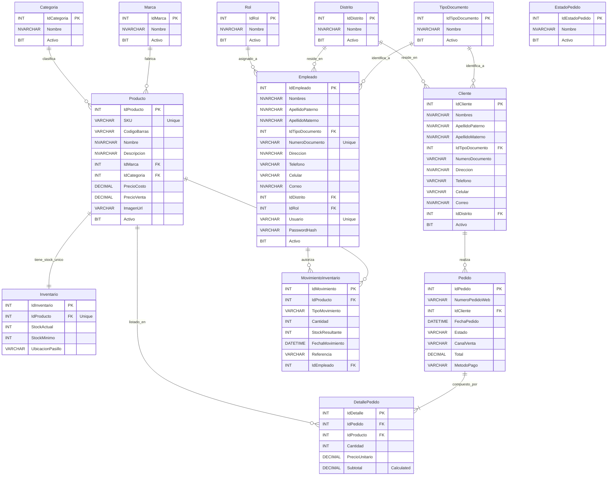

# Documentación del Esquema de Base de Datos - MascotifyDB

Este documento representa la estructura actual de la base de datos, incluyendo tablas maestras, transaccionales y de inventario.

```mermaid
erDiagram
    Categoria {
        INT IdCategoria PK
        NVARCHAR Nombre
        BIT Activo
    }

    Marca {
        INT IdMarca PK
        NVARCHAR Nombre
        BIT Activo
    }

    Distrito {
        INT IdDistrito PK
        NVARCHAR Nombre
        BIT Activo
    }

    Rol {
        INT IdRol PK
        NVARCHAR Nombre
        BIT Activo
    }

    TipoDocumento {
        INT IdTipoDocumento PK
        NVARCHAR Nombre
        BIT Activo
    }

    EstadoPedido {
        INT IdEstadoPedido PK
        NVARCHAR Nombre
        BIT Activo
    }

    Empleado {
        INT IdEmpleado PK
        NVARCHAR Nombres
        NVARCHAR ApellidoPaterno
        NVARCHAR ApellidoMaterno
        INT IdTipoDocumento FK
        VARCHAR NumeroDocumento "Unique"
        NVARCHAR Direccion
        VARCHAR Telefono
        VARCHAR Celular
        NVARCHAR Correo
        INT IdDistrito FK
        INT IdRol FK
        VARCHAR Usuario "Unique"
        VARCHAR PasswordHash
        BIT Activo
    }

    Cliente {
        INT IdCliente PK
        NVARCHAR Nombres
        NVARCHAR ApellidoPaterno
        NVARCHAR ApellidoMaterno
        INT IdTipoDocumento FK
        VARCHAR NumeroDocumento
        NVARCHAR Direccion
        VARCHAR Telefono
        VARCHAR Celular
        NVARCHAR Correo
        INT IdDistrito FK
        BIT Activo
    }

    Producto {
        INT IdProducto PK
        VARCHAR SKU "Unique"
        VARCHAR CodigoBarras
        NVARCHAR Nombre
        NVARCHAR Descripcion
        INT IdMarca FK
        INT IdCategoria FK
        DECIMAL PrecioCosto
        DECIMAL PrecioVenta
        VARCHAR ImagenUrl
        BIT Activo
    }

    Inventario {
        INT IdInventario PK
        INT IdProducto FK "Unique"
        INT StockActual
        INT StockMinimo
        VARCHAR UbicacionPasillo
    }

    Pedido {
        INT IdPedido PK
        VARCHAR NumeroPedidoWeb
        INT IdCliente FK
        DATETIME FechaPedido
        VARCHAR Estado
        VARCHAR CanalVenta
        DECIMAL Total
        VARCHAR MetodoPago
    }

    DetallePedido {
        INT IdDetalle PK
        INT IdPedido FK
        INT IdProducto FK
        INT Cantidad
        DECIMAL PrecioUnitario
        DECIMAL Subtotal "Calculated"
    }

    MovimientoInventario {
        INT IdMovimiento PK
        INT IdProducto FK
        VARCHAR TipoMovimiento
        INT Cantidad
        INT StockResultante
        DATETIME FechaMovimiento
        VARCHAR Referencia
        INT IdEmpleado FK
    }

    %% Relaciones
    TipoDocumento ||--o{ Empleado : "identifica_a"
    Distrito ||--o{ Empleado : "reside_en"
    Rol ||--o{ Empleado : "asignado_a"
    
    TipoDocumento ||--o{ Cliente : "identifica_a"
    Distrito ||--o{ Cliente : "reside_en"

    Marca ||--o{ Producto : "fabrica"
    Categoria ||--o{ Producto : "clasifica"
    
    Producto ||--|| Inventario : "tiene_stock_unico"

    Cliente ||--o{ Pedido : "realiza"
    Pedido ||--|{ DetallePedido : "compuesto_por"
    Producto ||--o{ DetallePedido : "listado_en"

    Producto ||--o{ MovimientoInventario : "historial_cambios"
    Empleado ||--o{ MovimientoInventario : "autoriza"

    %% Nota: EstadoPedido está creada pero no vinculada en el script SQL (Pedido usa VARCHAR directo)
```