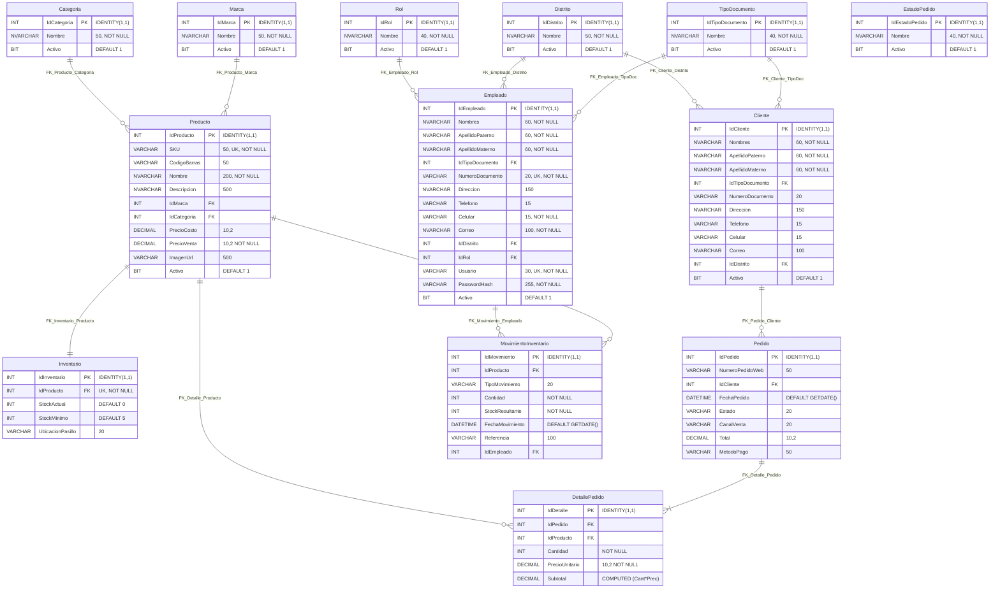

# Modelo Físico de Base de Datos - MascotifyDB (Corregido)

Se han ajustado los tipos de datos para compatibilidad con el renderizador de Mermaid (moviendo precisiones a los comentarios).

```mermaid
erDiagram
    %% ---------------------------------------------------------
    %% MÓDULO MAESTROS
    %% ---------------------------------------------------------
    Categoria {
        INT IdCategoria PK "IDENTITY(1,1)"
        NVARCHAR Nombre "50, NOT NULL"
        BIT Activo "DEFAULT 1"
    }

    Marca {
        INT IdMarca PK "IDENTITY(1,1)"
        NVARCHAR Nombre "50, NOT NULL"
        BIT Activo "DEFAULT 1"
    }

    Distrito {
        INT IdDistrito PK "IDENTITY(1,1)"
        NVARCHAR Nombre "50, NOT NULL"
        BIT Activo "DEFAULT 1"
    }

    Rol {
        INT IdRol PK "IDENTITY(1,1)"
        NVARCHAR Nombre "40, NOT NULL"
        BIT Activo "DEFAULT 1"
    }

    TipoDocumento {
        INT IdTipoDocumento PK "IDENTITY(1,1)"
        NVARCHAR Nombre "40, NOT NULL"
        BIT Activo "DEFAULT 1"
    }

    EstadoPedido {
        INT IdEstadoPedido PK "IDENTITY(1,1)"
        NVARCHAR Nombre "40, NOT NULL"
        BIT Activo "DEFAULT 1"
    }

    %% ---------------------------------------------------------
    %% MÓDULO PERSONAS
    %% ---------------------------------------------------------
    Empleado {
        INT IdEmpleado PK "IDENTITY(1,1)"
        NVARCHAR Nombres "60, NOT NULL"
        NVARCHAR ApellidoPaterno "60, NOT NULL"
        NVARCHAR ApellidoMaterno "60, NOT NULL"
        INT IdTipoDocumento FK
        VARCHAR NumeroDocumento "20, UK, NOT NULL"
        NVARCHAR Direccion "150"
        VARCHAR Telefono "15"
        VARCHAR Celular "15, NOT NULL"
        NVARCHAR Correo "100, NOT NULL"
        INT IdDistrito FK
        INT IdRol FK
        VARCHAR Usuario "30, UK, NOT NULL"
        VARCHAR PasswordHash "255, NOT NULL"
        BIT Activo "DEFAULT 1"
    }

    Cliente {
        INT IdCliente PK "IDENTITY(1,1)"
        NVARCHAR Nombres "60, NOT NULL"
        NVARCHAR ApellidoPaterno "60, NOT NULL"
        NVARCHAR ApellidoMaterno "60, NOT NULL"
        INT IdTipoDocumento FK
        VARCHAR NumeroDocumento "20"
        NVARCHAR Direccion "150"
        VARCHAR Telefono "15"
        VARCHAR Celular "15"
        NVARCHAR Correo "100"
        INT IdDistrito FK
        BIT Activo "DEFAULT 1"
    }

    %% ---------------------------------------------------------
    %% MÓDULO PRODUCTO E INVENTARIO
    %% ---------------------------------------------------------
    Producto {
        INT IdProducto PK "IDENTITY(1,1)"
        VARCHAR SKU "50, UK, NOT NULL"
        VARCHAR CodigoBarras "50"
        NVARCHAR Nombre "200, NOT NULL"
        NVARCHAR Descripcion "500"
        INT IdMarca FK
        INT IdCategoria FK
        DECIMAL PrecioCosto "10,2"
        DECIMAL PrecioVenta "10,2 NOT NULL"
        VARCHAR ImagenUrl "500"
        BIT Activo "DEFAULT 1"
    }

    Inventario {
        INT IdInventario PK "IDENTITY(1,1)"
        INT IdProducto FK "UK, NOT NULL"
        INT StockActual "DEFAULT 0"
        INT StockMinimo "DEFAULT 5"
        VARCHAR UbicacionPasillo "20"
    }

    %% ---------------------------------------------------------
    %% MÓDULO TRANSACCIONAL
    %% ---------------------------------------------------------
    Pedido {
        INT IdPedido PK "IDENTITY(1,1)"
        VARCHAR NumeroPedidoWeb "50"
        INT IdCliente FK
        DATETIME FechaPedido "DEFAULT GETDATE()"
        VARCHAR Estado "20"
        VARCHAR CanalVenta "20"
        DECIMAL Total "10,2"
        VARCHAR MetodoPago "50"
    }

    DetallePedido {
        INT IdDetalle PK "IDENTITY(1,1)"
        INT IdPedido FK
        INT IdProducto FK
        INT Cantidad "NOT NULL"
        DECIMAL PrecioUnitario "10,2 NOT NULL"
        DECIMAL Subtotal "COMPUTED (Cant*Prec)"
    }

    MovimientoInventario {
        INT IdMovimiento PK "IDENTITY(1,1)"
        INT IdProducto FK
        VARCHAR TipoMovimiento "20"
        INT Cantidad "NOT NULL"
        INT StockResultante "NOT NULL"
        DATETIME FechaMovimiento "DEFAULT GETDATE()"
        VARCHAR Referencia "100"
        INT IdEmpleado FK
    }

    %% RELACIONES
    TipoDocumento ||--o{ Empleado : "FK_Empleado_TipoDoc"
    Distrito ||--o{ Empleado : "FK_Empleado_Distrito"
    Rol ||--o{ Empleado : "FK_Empleado_Rol"

    TipoDocumento ||--o{ Cliente : "FK_Cliente_TipoDoc"
    Distrito ||--o{ Cliente : "FK_Cliente_Distrito"

    Marca ||--o{ Producto : "FK_Producto_Marca"
    Categoria ||--o{ Producto : "FK_Producto_Categoria"

    Producto ||--|| Inventario : "FK_Inventario_Producto"

    Cliente ||--o{ Pedido : "FK_Pedido_Cliente"
    Pedido ||--|{ DetallePedido : "FK_Detalle_Pedido"
    Producto ||--o{ DetallePedido : "FK_Detalle_Producto"

    Producto ||--o{ MovimientoInventario : "FK_Movimiento_Producto"
    Empleado ||--o{ MovimientoInventario : "FK_Movimiento_Empleado"
```
