# Modelo Lógico de Datos - MascotifyDB

Este documento representa la estructura lógica de la información del sistema. Define las entidades de negocio, sus atributos esenciales y las reglas de relación entre ellas, independientemente del motor de base de datos específico.

## 1. Diagrama de Entidad-Relación (Nivel Lógico)

```mermaid
erDiagram
    %% ---------------------------------------------------------
    %% MÓDULO DE CATÁLOGOS (MAESTROS)
    %% ---------------------------------------------------------
    Categoria {
        INT IdCategoria PK
        String Nombre
        Boolean Activo
    }

    Marca {
        INT IdMarca PK
        String Nombre
        Boolean Activo
    }

    Distrito {
        INT IdDistrito PK
        String Nombre
        Boolean Activo
    }

    Rol {
        INT IdRol PK
        String Nombre "Roles: Admin, Vendedor, Almacenero"
        Boolean Activo
    }

    TipoDocumento {
        INT IdTipoDocumento PK
        String Nombre "DNI, RUC, Pasaporte"
        Boolean Activo
    }

    EstadoPedido {
        INT IdEstadoPedido PK
        String Nombre "Pendiente, Pagado, Despachado"
        Boolean Activo
    }

    %% ---------------------------------------------------------
    %% MÓDULO DE ACTORES
    %% ---------------------------------------------------------
    Empleado {
        INT IdEmpleado PK
        String Nombres
        String Apellidos
        INT IdTipoDocumento FK
        String NumeroDocumento "Unique"
        String DatosContacto "Telf, Email, Dirección"
        INT IdRol FK
        INT IdDistrito FK
        String CredencialesAcceso "Usuario/Pass"
    }

    Cliente {
        INT IdCliente PK
        String Nombres
        String Apellidos
        INT IdTipoDocumento FK
        String NumeroDocumento
        String DatosContacto
        INT IdDistrito FK
    }

    %% ---------------------------------------------------------
    %% MÓDULO DE INVENTARIO
    %% ---------------------------------------------------------
    Producto {
        INT IdProducto PK
        String SKU "Identificador Único"
        String Nombre
        String Descripcion
        INT IdMarca FK
        INT IdCategoria FK
        Money PrecioCosto
        Money PrecioVenta
        Boolean Activo
    }

    Inventario {
        INT IdInventario PK
        INT IdProducto FK "Relación 1:1"
        Integer StockActual
        Integer StockMinimo
        String Ubicacion
    }

    %% ---------------------------------------------------------
    %% MÓDULO TRANSACCIONAL
    %% ---------------------------------------------------------
    Pedido {
        INT IdPedido PK
        String CodigoExterno "WooCommerce ID"
        INT IdCliente FK
        DateTime FechaEmision
        String EstadoActual
        Money MontoTotal
    }

    DetallePedido {
        INT IdDetalle PK
        INT IdPedido FK
        INT IdProducto FK
        Integer Cantidad
        Money PrecioUnitario "Precio congelado"
        Money Subtotal "Calculado"
    }

    MovimientoInventario {
        INT IdMovimiento PK
        INT IdProducto FK
        String TipoMovimiento "Entrada/Salida"
        Integer Cantidad
        Integer StockResultante "Auditoría"
        DateTime Fecha
        INT IdEmpleado FK "Responsable"
    }

    %% RELACIONES LÓGICAS
    Categoria ||--o{ Producto : "clasifica_a"
    Marca ||--o{ Producto : "fabricado_por"
    Producto ||--|| Inventario : "controla_stock_de"

    Cliente ||--o{ Pedido : "realiza_compra"
    Pedido ||--|{ DetallePedido : "se_compone_de"
    Producto ||--o{ DetallePedido : "es_listado_en"

    Empleado ||--o{ MovimientoInventario : "registra_operacion"
    Producto ||--o{ MovimientoInventario : "tiene_historial"
```

## 2. Definición de Entidades

### Entidades Maestras (Datos Estáticos)

Datos que varían poco en el tiempo y sirven para categorizar la información.

| Entidad           | Descripción                                           | Atributos Clave         |
| :---------------- | :---------------------------------------------------- | :---------------------- |
| **Categoria**     | Clasificación de productos (Ej. Alimentos, Juguetes). | Nombre, Activo          |
| **Marca**         | Fabricante o proveedor de la mercadería.              | Nombre, Activo          |
| **Distrito**      | Ubicación geográfica para logística y residencia.     | Nombre                  |
| **Rol**           | Perfil de seguridad del empleado (Permisos).          | Nombre (Admin/Vendedor) |
| **TipoDocumento** | Catálogo de documentos de identidad legales.          | DNI, RUC, CE            |

### Entidades de Negocio (Core)

El núcleo central del sistema de ventas.

| Entidad        | Descripción                 | Reglas de Negocio                                                  |
| :------------- | :-------------------------- | :----------------------------------------------------------------- |
| **Producto**   | Bien comercializable.       | Debe tener SKU único. Pertenece a una Marca y una Categoría.       |
| **Inventario** | Cantidad física disponible. | **Relación 1 a 1** con Producto. Gestiona alertas de Stock Mínimo. |
| **Empleado**   | Usuario del sistema.        | Tiene credenciales de acceso. Registra movimientos de almacén.     |
| **Cliente**    | Comprador final.            | Se registra con DNI/RUC. Asociado a un Distrito de entrega.        |

### Entidades Transaccionales (Operaciones)

Registros que crecen diariamente con el uso del sistema.

| Entidad                  | Descripción            | Reglas de Negocio                                                               |
| :----------------------- | :--------------------- | :------------------------------------------------------------------------------ |
| **Pedido**               | Cabecera de una venta. | Vincula al Cliente con la Fecha y el Total. Estado inicial: Pendiente.          |
| **DetallePedido**        | Líneas de la venta.    | Registra la cantidad y congela el precio unitario al momento de la venta.       |
| **MovimientoInventario** | Kardex / Auditoría.    | Historial inmutable. Registra qué entró, qué salió, cuándo y **quién** lo hizo. |

---

_Generado para la arquitectura lógica de Mascotify._
